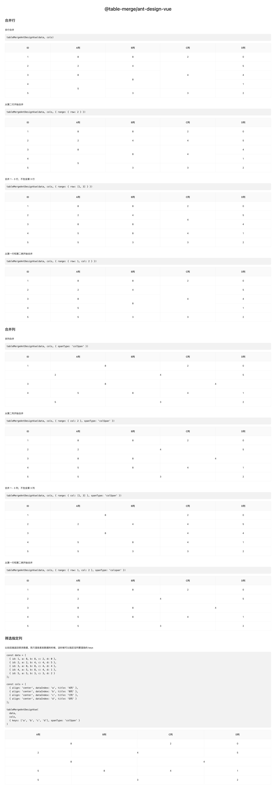

# @table-merge/ant-design-vue

极佳、极简的 [ant-design-vue](https://github.com/vueComponent/ant-design-vue) 表格合并方案。

## Getting Started

**Installation**

```bash
$ npm install @table-merge/ant-design-vue

# or
$ yarn add @table-merge/ant-design-vue

# or
$ pnpm add @table-merge/ant-design-vue
```

## Usage

```jsx
import tableMerge from '@table-merge/ant-design-vue';

const data = [
  { id: 1, a: 8, b: 8, c: 2, d: 0 },
  { id: 2, a: 2, b: 4, c: 4, d: 5 },
  { id: 3, a: 8, b: 8, c: 4, d: 4 },
  { id: 4, a: 5, b: 8, c: 4, d: 1 },
  { id: 5, a: 5, b: 3, c: 3, d: 2 }
];

const columns = [
  { dataIndex: 'id', label: 'ID' },
  { dataIndex: 'a', label: 'A列' },
  { dataIndex: 'b', label: 'B列' },
  { dataIndex: 'c', label: 'C列' },
  { dataIndex: 'd', label: 'D列' }
];

<a-table :dataSource="data" :columns="tableMerge(data, columns)" />
```

## API

**data**
表格的数据。

**columns**
见 [Table Column - Ant Design Vue](https://www.antdv.com/components/table-cn#Column)。

**options**

- **keys**
  type: `string[]`
  指定 `data` 中哪些列是在 `Table` 中渲染的

- **range**
  type: `number` | `[start: number, end: number]`

  当为 `number` 时，表示合并开始行或列；

  当为 `[start: number, end: number]` 时，表示[合并开始行/列，合并结束行/列]；

- **spanType**
  type: `rowSpan` | `colSpan`
  default: `rowSpan`

  指定要合并行还是合并列

## Examples


